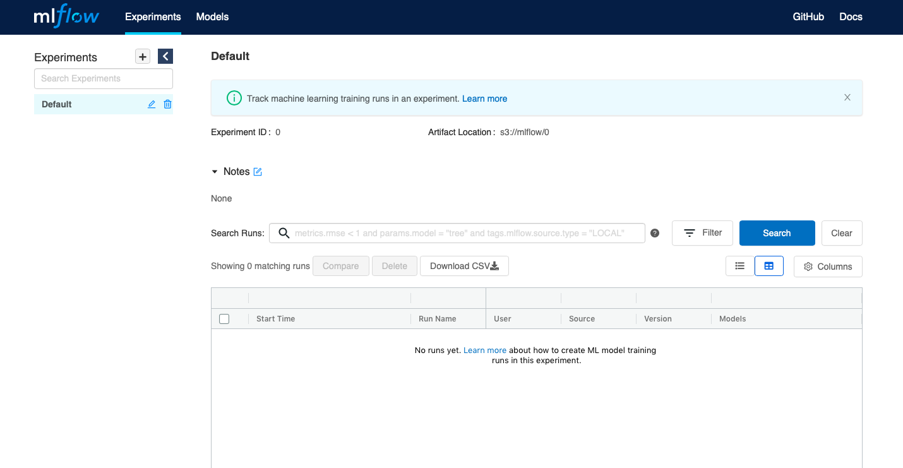

# MLops

This repository is a step by step tutorial on deploying multiple MLops tools:

- Jenkins
- MLflow
- Minio

## Prerequisites

- docker ([install](https://docs.docker.com/engine/install/))
- docker-compose ([install](https://docs.docker.com/compose/install/))
- conda [Optional] ([install](https://docs.anaconda.com/anaconda/install/) you need CLI version)

## Installation

1. Create ```.env``` file at the root of the project and pass this variables:

```bash
MINIO_ACCESS_KEY=root
MINIO_SECRET_KEY=toortoor
AWS_ACCESS_KEY_ID=root
AWS_SECRET_ACCESS_KEY=toortoor
MLFLOW_S3_ENDPOINT_URL=http://localhost:9000
POSTGRES_USER=root
POSTGRES_PASSWORD=toor
```

2. Up containers via ```docker-compose```:

```bash
docker-compose --env-file ./.env up -d
```

You should see something like this in your terminal:

```bash
Starting s3                         ... done
Starting jenkins                  ... done
Starting postgresql ... done
Starting mlops_pipeline_waitfordb_1 ... done
Starting mlflow_server              ... done
```

3. Install python packages
    - use only python3-pip:

        ```bash
        pip3 install -r requirements.txt
        ```

    - use conda

        ```bash
        conda create -n mlflow_env python=3.8
        ```

        ```bash
        conda activate mlflow_env
        ```

        ```bash
        conda install --file requirements.txt
        ```

## Usage

### MLflow

After all the containers are started, you can enter ```htttp://localhost:5000``` in your browser and you should see something like this


Then you can run

```bash
python3 train_example.py
```

and see experiment in MLflow UI